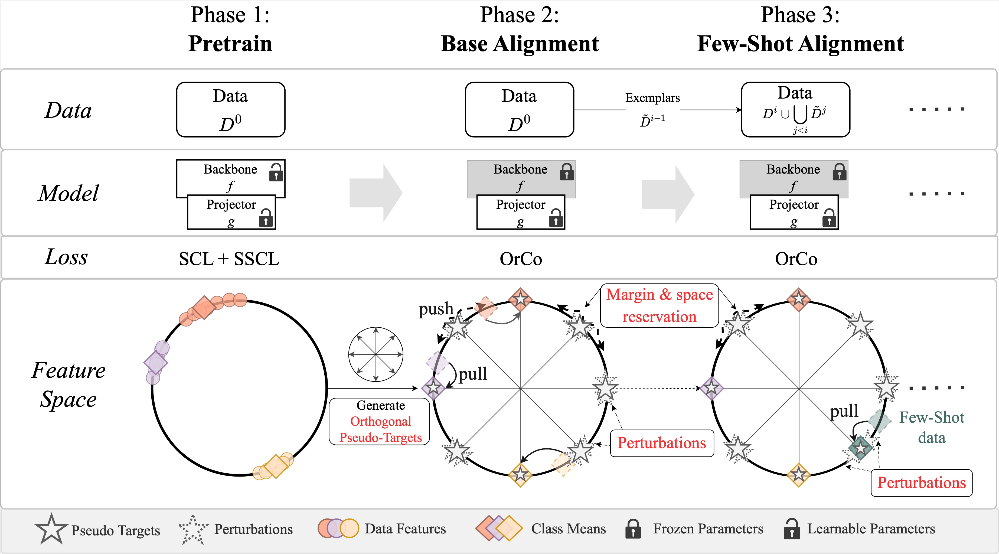
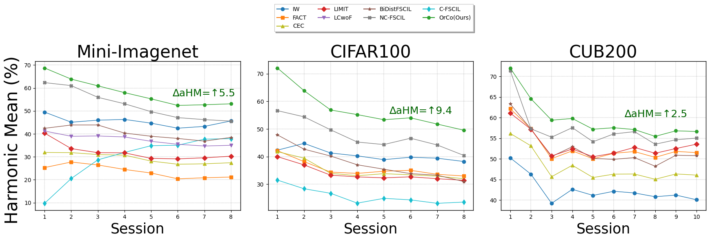

# OrCo: Towards Better Generalization via Orthogonality and Contrast for Few-Shot Class-Incremental Learning

\
PyTorch implementation of the OrCo Framework, CVPR 2024 highlight  🎉 

## Abstract
Few-Shot Class-Incremental Learning (FSCIL) introduces a paradigm in which the problem space expands with limited data. FSCIL methods inherently face the challenge of catastrophic forgetting as data arrives incrementally, making models susceptible to overwriting previously acquired knowledge. Moreover, given the scarcity of labeled samples available at any given time, models may be prone to overfitting and find it challenging to strike a balance between extensive pretraining and the limited incremental data. To address these challenges, we propose the OrCo framework built on two core principles: features' orthogonality in the representation space, and contrastive learning. In particular, we improve the generalization of the embedding space by employing a combination of supervised and self-supervised contrastive losses during the pretraining phase. Additionally, we introduce OrCo loss to address challenges arising from data limitations during incremental sessions. Through feature space perturbations and orthogonality between classes, the OrCo loss maximizes margins and reserves space for the following incremental data. This, in turn, ensures the accommodation of incoming classes in the feature space without compromising previously acquired knowledge. Our experimental results showcase state-of-the-art performance across three benchmark datasets, including mini-ImageNet, CIFAR100, and CUB datasets.

## OrCo Framework

## Results

## Requirements
- [PyTorch >= version 1.13.1](https://pytorch.org)
- tqdm
- matplotlib
- pandas
- scikit-learn
- numpy
- prettytable

## Datasets and pretrained models
We follow [FSCIL](https://github.com/xyutao/fscil) setting and use the same data index_list for training splits across incremental sessions. 
For Phase 1 of the OrCo framework and the datasets CIFAR100 and mini-ImageNet, we use the [solo-learn](https://github.com/vturrisi/solo-learn) library to train our model. You can download the pretrained models [here](https://drive.google.com/drive/folders/1bn7U5bWtGmubv_zIvyBwOMlBKFOFwquI?usp=sharing). Place the downloaded models under `./params/OrCo/` and unzip it. Note that for CUB200 we do not perform phase 1 given that it is common in literature to use an ImageNet pretrained model for incremental tasks. This is automatically handled from within the code.

The datasets are made readily available by the authors of CEC in their github repository [here](https://github.com/icoz69/CEC-CVPR2021?tab=readme-ov-file#datasets-and-pretrained-models). Follow their provided instructions to download and unzip. We assume in our code that the datasets are present inside a `datasets` folder on the same directory level as the cloned repository. If this is not the case then you will need to overwrite the correct path in the shell script.

## Training

With the current setup, Phase 2 and Phase 3 (Base and Incremental Sessions) of our pipeline are run sequentially with a single command. The final metrics can then be found in the `./logs` under the appropriate datasets. Find the scripts with the best hyperparameters under `./scripts`. 

As an example, to run the mini-ImageNet experiment from the paper:

    $ chmod +x ./scripts/run_minet.sh
    $ ./scripts/run_minet.sh

For the above experiments find the computed metrics available under: `mini_imagenet/orco/<save_path_prefix>_<hp1_choice>-<hp2_choice>/results.txt`

## Citation
If you use this code to assist your research, please cite our paper using the following bib entry:

        @inproceedings{ahmed2024orco,
            title={OrCo: Towards Better Generalization via Orthogonality and Contrast for Few-Shot Class-Incremental Learning},
            author={Ahmed, Noor and Kukleva, Anna and Schiele, Bernt},
            booktitle={41st IEEE/CVF Conference on Computer Vision and Pattern Recognition},
            year={2024},
            organization={IEEE}
        }

## Acknowledgment
Our project references the codes in the following repositories.

- [CEC](https://github.com/icoz69/CEC-CVPR2021)
- [solo-learn](https://github.com/vturrisi/solo-learn)
- [fscil](https://github.com/xyutao/fscil)
- [FACT](https://github.com/zhoudw-zdw/CVPR22-Fact)
- [NC-FSCIL](https://github.com/NeuralCollapseApplications/FSCIL)
